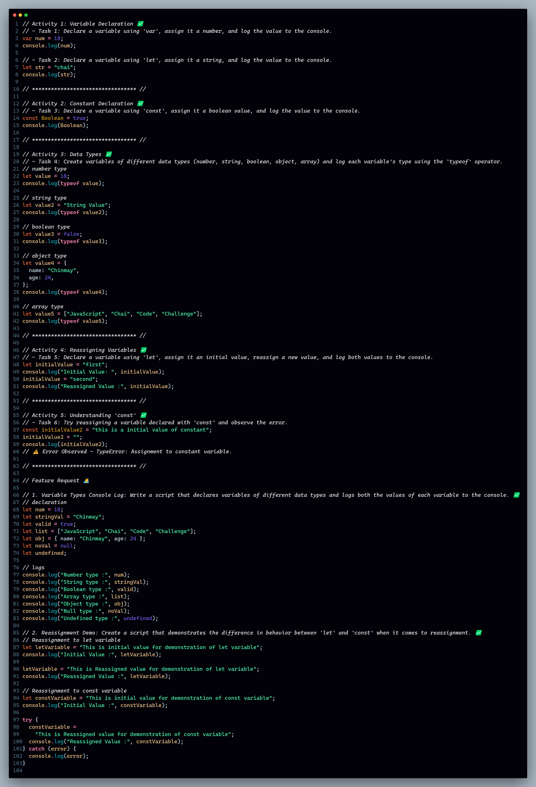

# Day-01 : Variables and Data Types 🍵❤️‍🔥

## Tasks | Activities 🌟

_**Activity 1: Variable Declaration**_

- **Task 1:** Declare a variable using `var`, assign it a number, and log the value to the console.
- **Task 2:** Declare a variable using `let`, assign it a string, and log the value to the console.

_**Activity 2: Constant Declaration**_

- **Task 3:** Declare a variable using `const`, assign it a boolean value, and log the value to the console.

_**Activity 3: Data Types**_

- **Task 4:** Create variables of different data types (number, string, boolean, object, array) and log each variable's type using the `typeof` operator.

_**Activity 4: Reassigning Variables**_

- **Task 5:** Declare a variable using `let`, assign it an initial value, reassign a new value, and log both values to the console.

_**Activity 5: Understanding `const`**_

- **Task 6:** Try reassigning a variable declared with `const` and observe the error.

### Feature Request 🙇‍♂️

1. **Variable Types Console Log:** Write a script that declares variables of different data types and logs both the values of each variable to the console.

2. **Reassignment Demo:** Create a script that demonstrates the difference in behavior between `let` and `const` when it comes to reassignment.

### Achievement 🏆

By the end of these activities, you will:

- Know how to declare variables using `var`, `let`, and `const`.
- Understand the different data types in JavaScript.
- Be able to use the `typeof` operator to identify the data types of a variable.
- Understand the concept of variable reassignment and the immutability of `const` variables.
