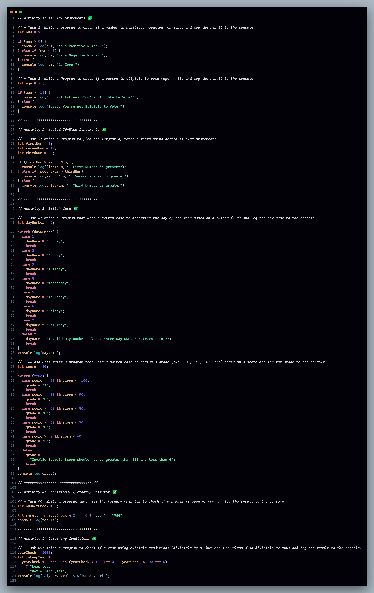

# Day-03 : Control Structures 🍵❤️‍🔥

## Tasks | Activities 🌟

_**Activity 1: If-Else Statements**_

- **Task 1:** Write a program to check if a number is positive, negative, or zero, and log the result to the console.
- **Task 2:** Write a Program to check if a person is eligible to vote (age >= 18) and log the result to the console.

_**Activity 2: Nested If-Else Statements**_

- **Task 3:** Write a program to find the largest of three numbers using nested if-else statements.

_**Activity 3: Switch Case**_

- **Task 4:** Write a program that uses a switch case to determine the day of the week based on a number (1-7) and log the day name to the console.
- **Task 5:** Write a program that uses a switch case to assign a grade ('A', 'B', 'C', 'D', 'f') based on a score and log the grade to the console.

_**Activity 4: Conditional (Ternary) Operator**_

- **Task 6:** Write a program that uses the ternary operator to check if a number is even or odd and log the result to the console.

_**Activity 5: Combining Conditions**_

- **Task 7:** Write a program to check if a year using multiple conditions (divisible by 4, but not 100 unless also divisible by 400) and log the result to the console.

### Feature Request 🙇‍♂️

1. **Number Check Script:** Write a script that checks if a number is possible, negative, or zero using if-else statements and logs the result.

2. **Voting Eligibility Script:** Create a script to check if a person is eligible to vote based on their age and log the result.

3. **Day of the Week Script:** Write a script that uses a switch case to determine the day of the week based on a number (1-7) and logs the day name.

4. **Grade Assignment Script:** Create a script that uses a switch case to assign a grade based on a score and logs the grade.

5. **Leap Year Check Script:** Write a script that checks if a year is a leap year using multiple conditions and logs the result.

### Achievement 🏆

By the end of these activities, you will:

- Implement and understand basic if-else control flow.
- Use nested if-else statements to handle multiple conditions.
- Ultilize switch cases for control flow based on specific values.
- Apply the ternary operator for concise condition checking.
- Combine multiple conditions to solve more complex problems.
