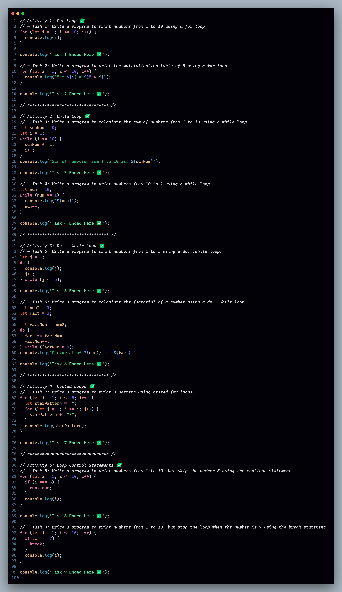
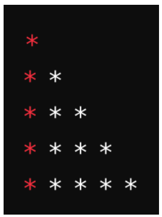

# Day 4: Loops 🍵❤️‍🔥

## Tasks | Activities 🌟

_**Activity 1: For Loop**_

- **Task 1:** Write a program to print numbers from 1 to 10 using a for loop.

- **Task 2:** Write a program to print the multiplication table of 5 using a for loop.

_**Activity 2: While Loop**_

- **Task 3:** Write a program to calculate the sum of numbers from 1 to 10 using a while loop.

- **Task 4:** Write a program to print numbers from 10 to 1 using a while loop.

_**Activity 3: Do... While Loop**_

- **Task 5:** Write a program to print numbers from 1 to 5 using a do...while loop.

- **Task 6:** Write a program to calculate the factorial of a number using a do...while loop.

_**Activity 4: Nested Loops**_

- **Task 7:** Write a program to print a pattern using nested for loops:

(ignore color)

_**Activity 5: Loop Control Statements**_

- **Task 8:** Write a program to print numbers from 1 to 10, but skip the number 5 using the continue statement.

- **Task 9:** Write a program to print numbers from 1 to 10, but stop the loop when the number is 7 using the break statement.

Feature Request 🙇‍♂️

1. **Number Printing Script:** Write a script that prints numbers from 1 to 10 using a for loop and a while loop.

2. **Multiplication Table Script:** Create a script that prints the multiplication table of 5 using a for loop.

3. **Pattern Printing Script:** Write a script that prints a pattern of stars using nested loops.

4. **Sum Calculation Script:** Write a script that calculates the sum of numbers from 1 to 10 using a while loop.

5. **Factorial Calculation Script:** Create a script that calculates the factorial of a number using a do...while loop.

### Achievement 🏆

By the end of these activities, students will:

- Understand and use for loops to iterate over a sequence of numbers.

- Utilize while loops for iteration based on a condition.

- Apply do...while loops to ensure the loop body is executed at least once.

- Implement nested loops to solve more complex problems.

- Use loop control statements (break and continue) to control the flow of loops.
