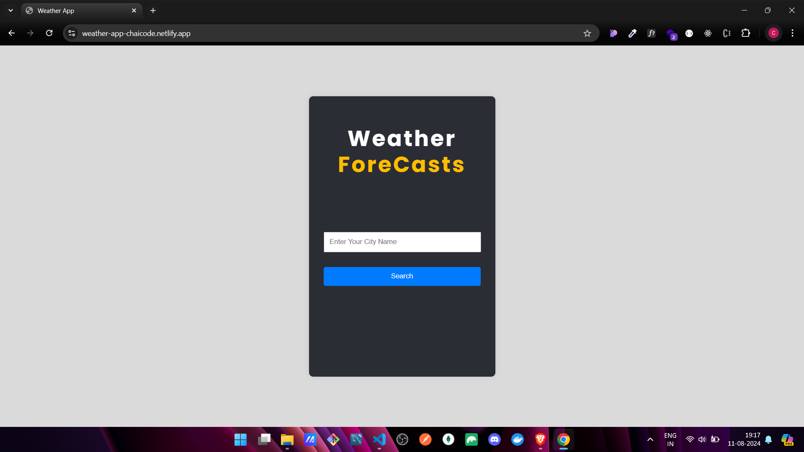
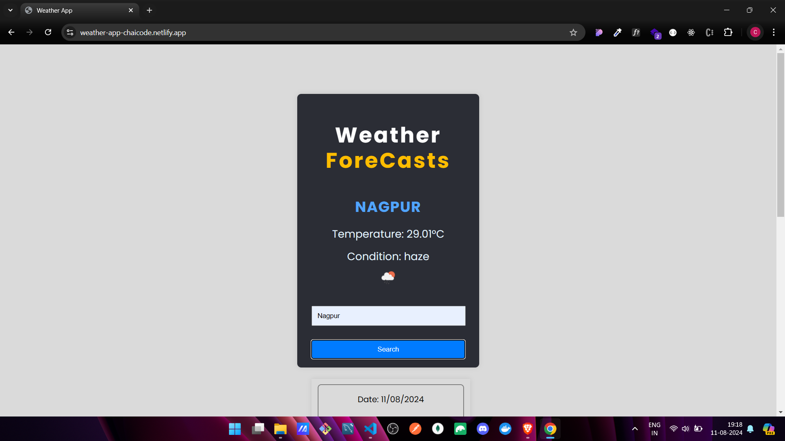

# ☀️ Weather App Project

Welcome to the **Weather App** project, a simple and interactive application that allows users to check the current weather and a 5-day forecast for any city.

## 🌟 Features

- **Current Weather:** Fetch and display the current temperature, weather condition, and city name.
- **Search Functionality:** Look up weather information by entering the name of any city.
- **5-Day Forecast:** View a 5-day weather forecast with daily temperature and weather conditions.
- **Interactive UI:** Visually appealing interface with weather icons and CSS animations.

## 🛠️ Tech Stack

- **HTML5:** Structure of the web pages.
- **CSS3:** Styling for a responsive and interactive design.
- **JavaScript (ES6+):** Core functionality, including data fetching, search, and UI enhancements.
- **Fetch API:** For retrieving weather data from a public API (e.g., OpenWeatherMap).

## 🚀 Getting Started

Follow these instructions to set up the project on your local machine.

### Prerequisites

- A code editor like [Visual Studio Code](https://code.visualstudio.com/).
- Basic knowledge of HTML, CSS, and JavaScript.
- API key from [OpenWeatherMap](https://openweathermap.org/) (if needed).

### Installation

1. **Clone the repository:**
   ```bash
   git clone https://github.com/ChinmayKaitade/Day-24_Project-01_Weather_App.git
   ```
2. **Navigate to the project directory:**
   ```bash
   cd Project-01 Weather App
   ```
3. **Open the project in your code editor:**
   ```bash
   code .
   ```
4. **Run the project:**
   Open the `index.html` file in your browser to view the weather app.

## 📂 Project Structure

```plaintext
weather-app/
├── index.html
├── style.css
├── script.js
└── README.md
```

- **index.html:** Main HTML structure for the app.
- **style.css:** Stylesheet for the app's appearance.
- **script.js:** JavaScript for dynamic content and interactivity.
- **README.md:** Project documentation.

## 📊 Data Source

This project uses the [OpenWeatherMap API](https://openweathermap.org/) to fetch current weather and forecast data.

## 🎯 Future Enhancements

- **Geolocation:** Automatically detect and display weather for the user's current location.
- **Weather Alerts:** Display weather alerts or warnings for severe conditions.
- **Unit Conversion:** Allow users to switch between Celsius and Fahrenheit.

## 📸 Screenshots





🔗[Live Demo Link](https://weather-app-chaicode.netlify.app/)

## 📄 License

This project is licensed under the MIT License - see the [LICENSE](LICENSE) file for details.

## 📩 Lets Connect

<a href="https://www.linkedin.com/in/chinmay-sharad-kaitade/" target="blank"></a> | <a href="https://www.instagram.com/chinmaykaitade_hunter/" target="blank"></a> | <a href="https://x.com/chinmaydotcom" target="blank"></a>
