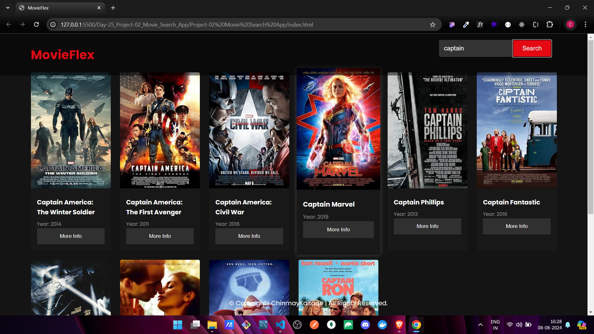
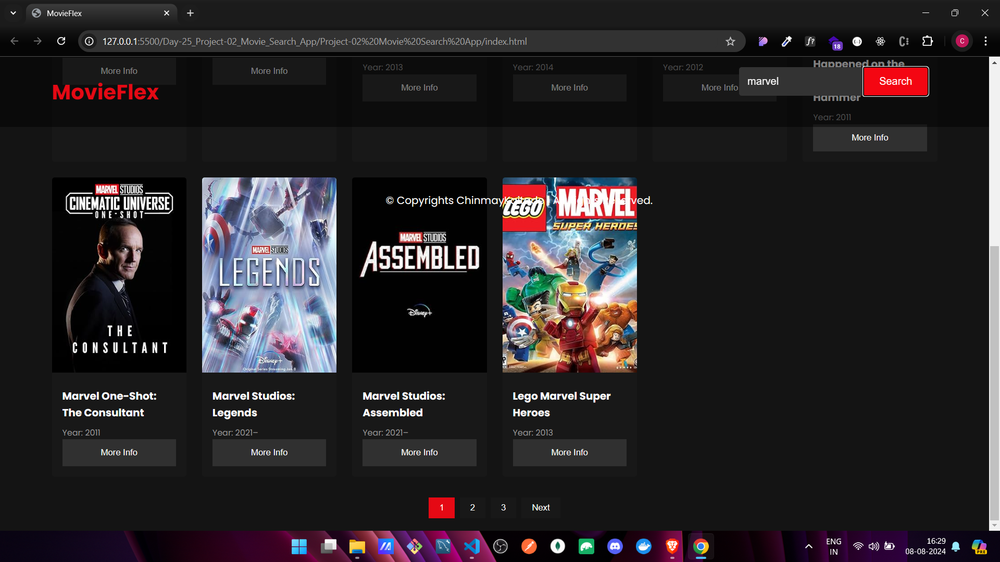

🚀 **Project Highlight: Movie Search App 🍿🎬**

Dive into the world of movies with our **Movie Search App**, a sleek and dynamic web application that allows users to explore and discover movie details with just a few clicks. This project is a blend of modern web technologies and user-centric design, delivering a seamless experience to movie enthusiasts.

### **Key Features & Technologies Used:**

1. **🎯 Search Functionality:**

   - **Technology:** JavaScript (ES6+), Fetch API
   - **Feature:** Users can easily search for movies by title. The app fetches real-time data from a public movie API (e.g., OMDB or The Movie Database API), displaying relevant search results instantly.

2. **📊 Movie Data Display:**

   - **Technology:** HTML5, CSS3
   - **Feature:** The app elegantly showcases movie details, including titles, posters, and release years, making it visually appealing and easy to navigate.

3. **🔍 Detailed Information View:**

   - **Technology:** JavaScript, Fetch API, Modal
   - **Feature:** A "More Info" button for each movie provides users with in-depth information, such as the plot, director, and actors. This additional content is displayed in a stylish modal or a dedicated section, enhancing the user's browsing experience.

4. **💅 Enhanced UI/UX:**
   - **Technology:** CSS3, Animations
   - **Feature:** The app is designed with a clean, modern UI. Subtle CSS animations and transitions make interactions smooth and enjoyable, creating a visually appealing and responsive user experience.

### **Why This Project Stands Out:**

- **Interactive Search Experience:** The app's search functionality is robust, providing users with quick access to a vast database of movies.
- **Detailed Insights:** Beyond just the basics, users can delve deeper into movie details, enriching their browsing experience.
- **Aesthetically Pleasing:** The thoughtful design and smooth animations elevate the app's overall feel, making it a pleasure to use.

Live Demo - 

## Output Images 🌟

## 📩 Lets Connect

 |  | 
