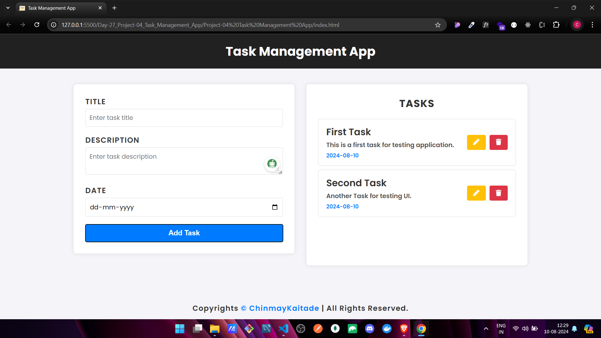

# 📝 Task Management App

## Overview

The **Task Management App** is your go-to tool for keeping track of daily tasks. With features like task creation, editing, updating, and deletion, this app ensures you stay organized and on top of your game! Built with HTML, CSS, and JavaScript, it's lightweight, efficient, and super easy to use. 🎯

## ✨ Features

- **➕ Task Creation**: Easily add new tasks with details like title, description, and due date.
- **📋 Task Display**: View your tasks in a well-organized list with all the essential details.
- **✏️ Task Editing**: Update any task's details with just a click.
- **❌ Task Deletion**: Safely delete tasks with a confirmation prompt to prevent accidents.
- **🎨 User-Friendly Interface**: Enjoy a clean, visually appealing design that enhances your experience.

## 💻 Technologies Used

- **HTML**: Structuring the app’s content.
- **CSS**: Styling the app to make it visually appealing.
- **JavaScript**: Handling all the app’s functionalities, including task creation, reading, updating, and deletion.

## 🚀 Usage

### 1. Setting Up the Project

1. 📂 Clone this repository to your local machine.
2. 🌐 Open the project directory and launch `index.html` in your browser.

### 2. Adding a New Task

1. 📝 Fill in the task details (title, description, due date) in the form provided.
2. ➕ Click the **Add Task** button to create and display the task in the list.

### 3. Editing a Task

1. ✏️ Click the **Edit** button next to the task you want to edit.
2. 🛠 Modify the task details in the form.
3. 💾 Click **Update Task** to save changes and refresh the list.

### 4. Deleting a Task

1. ❌ Click the **Delete** button next to the task you want to remove.
2. ⚠️ Confirm the deletion in the dialog to permanently delete the task.

## 📸 Screenshots

[Live Demo Link]()

## 🎯 Conclusion

Stay organized and on top of your tasks with this simple, intuitive app. Its clean design and powerful features make task management a breeze. 💪

