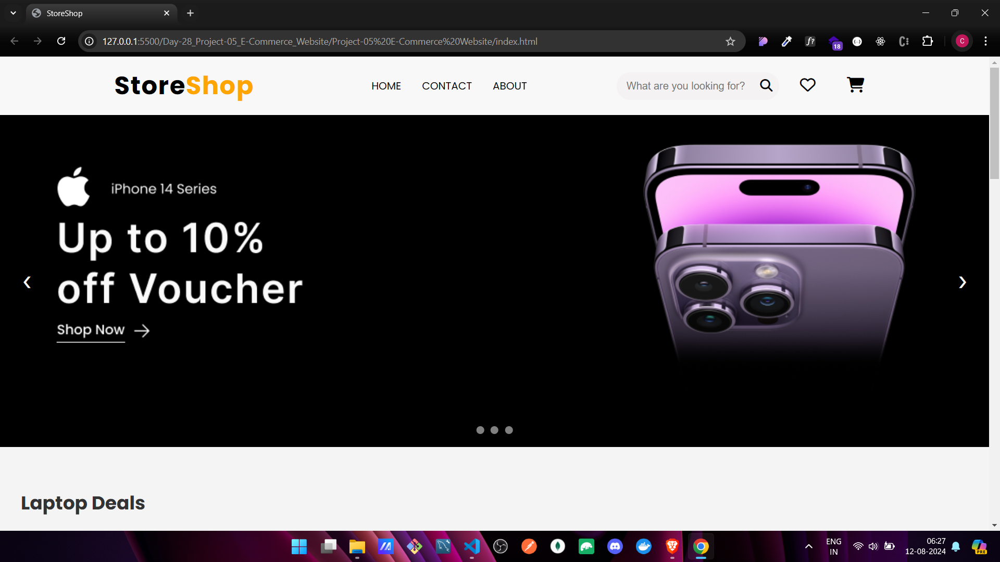
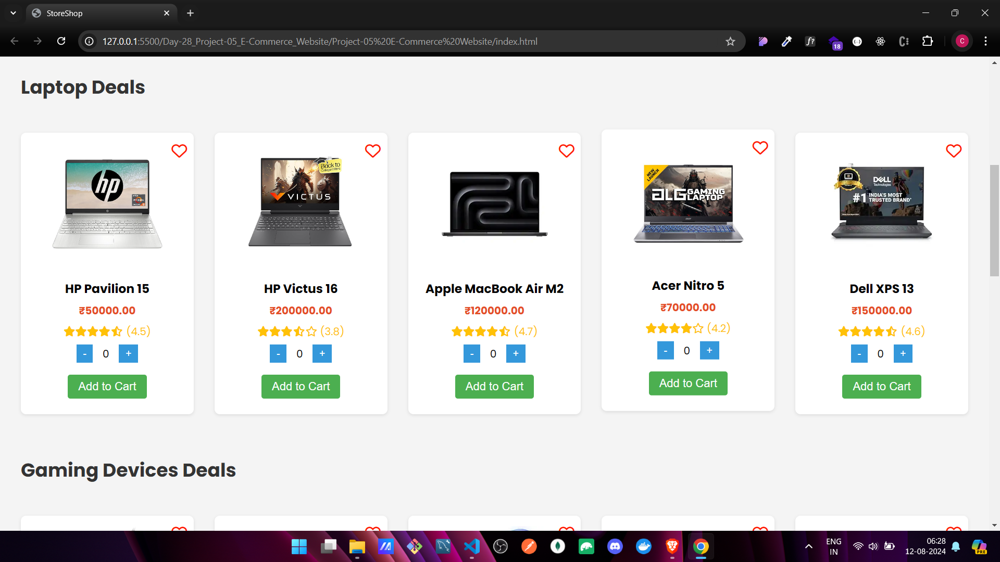
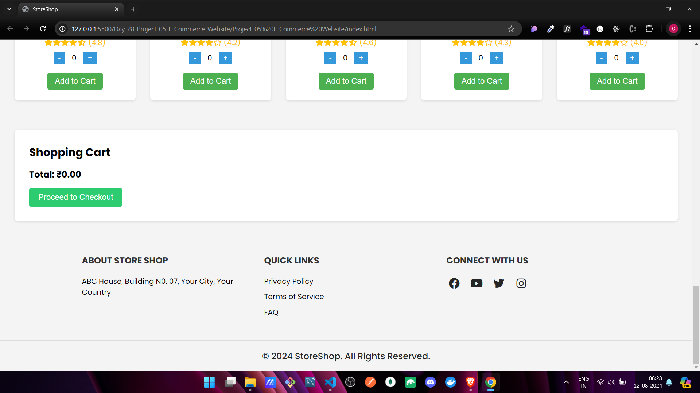

# 🛒 E-commerce Website Project

Welcome to the **E-commerce Website** project, a simple and interactive online shopping platform where users can browse products, add them to the cart, and simulate a checkout process.

## 🌟 Features

- **Product Listing:** Browse a variety of products dynamically generated from a JSON file or array.
- **Shopping Cart:** Add products to the cart, update quantities, and remove items.
- **Cart Management:** Seamlessly manage your shopping cart with easy-to-use controls.
- **Checkout Process:** Collect user information and simulate a checkout with a confirmation message.
- **Responsive Design:** A clean and user-friendly interface, styled with CSS.

## 🛠️ Tech Stack

- **HTML5:** Structure of the web pages.
- **CSS3:** Styling for a visually appealing and responsive design.
- **JavaScript (ES6+):** Core functionality, including product listing, cart management, and checkout process.
- **JSON:** Simulated database for storing product information.

## 🚀 Getting Started

Follow these instructions to set up the project on your local machine.

### Prerequisites

- A code editor like [Visual Studio Code](https://code.visualstudio.com/).
- Basic knowledge of HTML, CSS, and JavaScript.

### Installation

1. **Clone the repository:**
   ```bash
   git clone https://github.com/ChinmayKaitade/Day-28_Project-05_E-Commerce_Website.git
   ```
2. **Navigate to the project directory:**
   ```bash
   cd Project-05 E-Commerce Website
   ```
3. **Open the project in your code editor:**
   ```bash
   code .
   ```
4. **Run the project:**
   Open the `index.html` file in your browser to view the e-commerce website.

## 📂 Project Structure

```plaintext
Project-05 E-Commerce Website/
├── index.html
├── style.css
├── script.js
├── checkout.html
├── checkout.js
├── shopping.js
└── README.md
```

- **index.html:** Main HTML structure for the website.
- **style.css:** Stylesheet for the website's appearance.
- **script.js:** JavaScript for dynamic content and interactivity.
- **products.json:** JSON file containing product data.
- **README.md:** Project documentation.

## 📸 Screenshots

🔗[Live Demo Link](https://e-commerce-website-chaicode.netlify.app/)







## 🎯 Future Enhancements

- **Database Integration:** Connect to a real database to manage product data.
- **User Authentication:** Implement a login and signup system.
- **Payment Gateway:** Integrate a real payment gateway for transactions.

## 📄 License

This project is licensed under the MIT License - see the [LICENSE](LICENSE) file for details.

## 📩 Lets Connect

<a href="https://www.linkedin.com/in/chinmay-sharad-kaitade/" target="blank"></a> | <a href="https://www.instagram.com/chinmaykaitade_hunter/" target="blank"></a> | <a href="https://x.com/chinmaydotcom" target="blank"></a>
