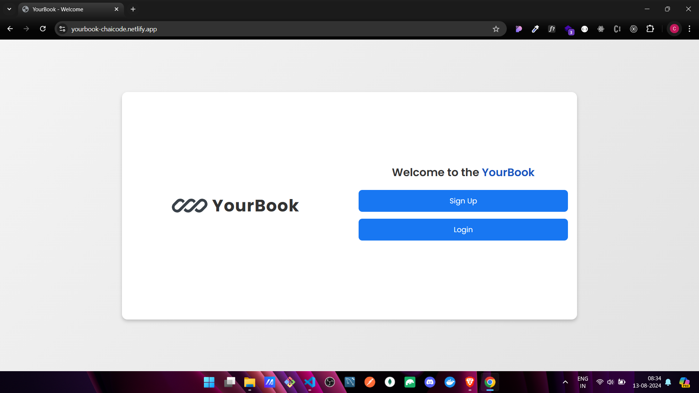
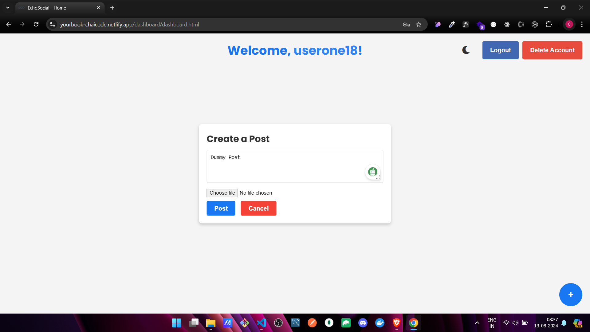
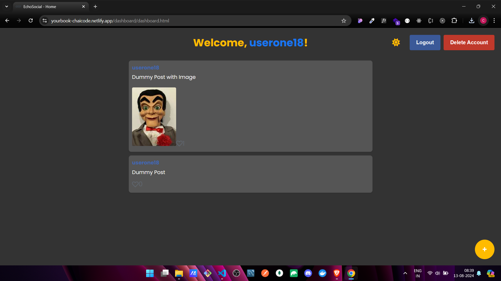

# 🗂️ Social Media Dashboard 🚀

## 🎯 Project Overview

Welcome to the **Social Media Dashboard**! This project is a mini social media platform where users can log in, create posts, like, and comment on posts, all within a beautifully designed dashboard. 🌟

## 📌 Features

- **User Authentication**: Secure login with username and password, with user sessions managed via `localStorage` or `sessionStorage`.
- **Post Creation**: Users can create posts with text and images, which are then displayed in a dynamic feed.
- **Post Display**: Posts are displayed in a visually appealing feed, with details like username, timestamp, and content.
- **Post Interactions**: Users can like posts and add comments, with live updates on the number of likes and comments.
- **UI Enhancements**: The dashboard includes CSS animations, distinct styles for different users, and a responsive layout.

## 🛠️ Technologies Used

- **HTML5**: Structure and content of the social media dashboard.
- **CSS3**: Styling for the dashboard, including animations and responsive design.
- **JavaScript (ES6+)**: Handling user interactions, form submissions, and dynamic content updates.
- **LocalStorage/SessionStorage**: Managing user sessions and storing post data.

## 🚀 Getting Started

1. **Clone the Repository**:

   ```bash
   git clone https://github.com/ChinmayKaitade/Day-29_Project-06_Social_Media_Dashboard.git
   ```

2. **Navigate to the Project Directory**:

   ```bash
   cd Project-06 Social Media Dashboard
   ```

3. **Open the Project**:
   - Open `index.html` in your preferred browser.

## 📸 Screenshots

🔗[Live Demo Link](https://yourbook-chaicode.netlify.app/)







## 🚧 Future Scope

- **User Registration**: Implement user registration with email verification.
- **Profile Pages**: Add personal profile pages where users can view and edit their information.
- **Advanced Post Interactions**: Add features like sharing posts, saving posts, and reporting inappropriate content.
- **Dark Mode**: Include a dark mode option for better user experience during nighttime.
- **Backend Integration**: Integrate a backend (e.g., Node.js, Firebase) for persistent data storage and more robust authentication.

## 💻 Contributing

Contributions are welcome! Please fork this repository and submit a pull request for any enhancements or bug fixes.

## 📄 License

This project is licensed under the MIT License - see the [LICENSE](LICENSE) file for details.

## 📩 Lets Connect

<a href="https://www.linkedin.com/in/chinmay-sharad-kaitade/" target="blank"></a> | <a href="https://www.instagram.com/chinmaykaitade_hunter/" target="blank"></a> | <a href="https://x.com/chinmaydotcom" target="blank"></a>
