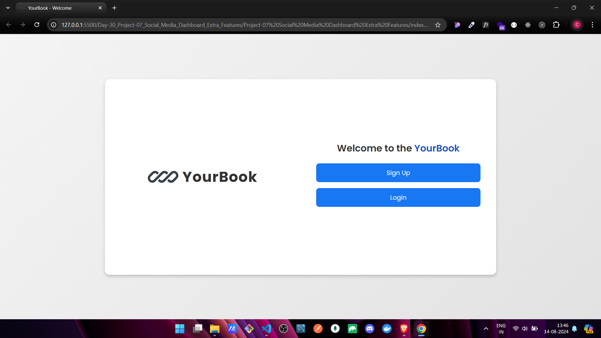
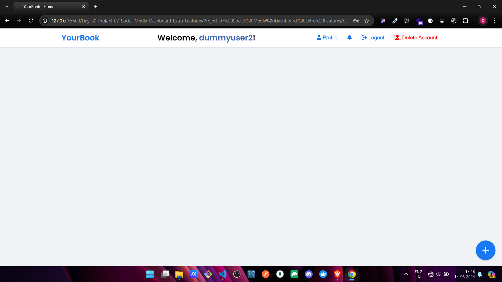
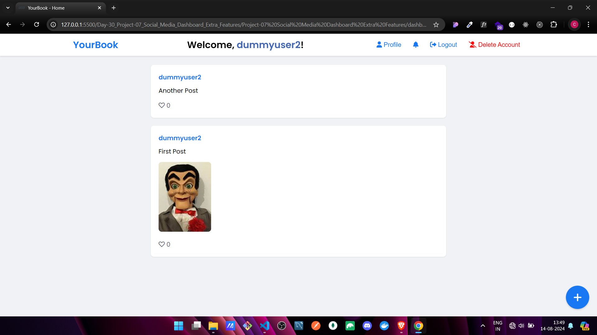

# 🗂️ Social Media Dashboard 🚀


## 🎯 Project Overview

Welcome to the **Social Media Dashboard**! This project is a mini social media platform where users can log in, create posts, like, and comment on posts, all within a beautifully designed dashboard. 🌟

## 📌 Features

- **User Authentication**: Secure login with username and password, with user sessions managed via `localStorage` or `sessionStorage`.
- **Post Creation**: Users can create posts with text and images, which are then displayed in a dynamic feed.
- **Post Display**: Posts are displayed in a visually appealing feed, with details like username, timestamp, and content.
- **Post Interactions**: Users can like posts and add comments, with live updates on the number of likes and comments.
- **UI Enhancements**: The dashboard includes CSS animations, distinct styles for different users, and a responsive layout.

## 🛠️ Technologies Used

- **HTML5**: Structure and content of the social media dashboard.
- **CSS3**: Styling for the dashboard, including animations and responsive design.
- **JavaScript (ES6+)**: Handling user interactions, form submissions, and dynamic content updates.
- **LocalStorage/SessionStorage**: Managing user sessions and storing post data.


## 🚀 Getting Started

1. **Clone the Repository**:

   ```bash
   git clone https://github.com/ChinmayKaitade/Day-30_Project-07_Social_Media_Dashboard_Extra_Features.git
   ```

2. **Navigate to the Project Directory**:

   ```bash
   cd Project-07 Social Media Dashboard Extra Features
   ```

3. **Open the Project**:
   - Open `index.html` in your preferred browser.
   
## 📸 Screenshots

🔗 [Live Demo Link](https://yourbook-features-chaicode.netlify.app/)







## 🚧 Future Scope

- **User Registration**: Implement user registration with email verification.
- **Profile Pages**: Add personal profile pages where users can view and edit their information.
- **Advanced Post Interactions**: Add features like sharing posts, saving posts, and reporting inappropriate content.
- **Dark Mode**: Include a dark mode option for better user experience during nighttime.
- **Backend Integration**: Integrate a backend (e.g., Node.js, Firebase) for persistent data storage and more robust authentication.

## 💻 Contributing

Contributions are welcome! Please fork this repository and submit a pull request for any enhancements or bug fixes.

## 📄 License

This project is licensed under the MIT License. See the [LICENSE](LICENSE) file for details.

## 🙌 Acknowledgements

Special thanks to [Hitesh Choudhary](https://github.com/hiteshchoudhary) for inspiring this project through the **30 Days JavaScript Challenge**.

---

Feel free to replace the placeholder links (like the image link and GitHub repository link) with your actual project details. This README template is designed to be visually appealing and informative, making it easy for others to understand and contribute to your project.
